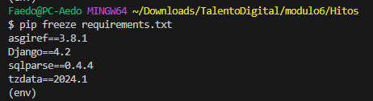
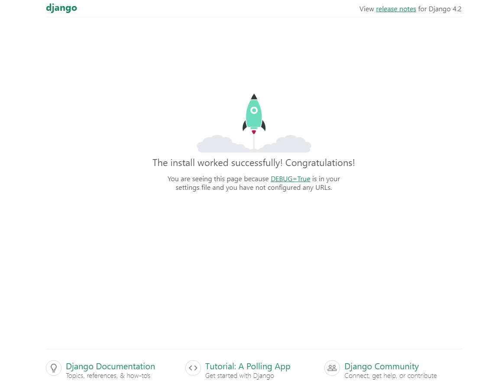
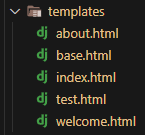
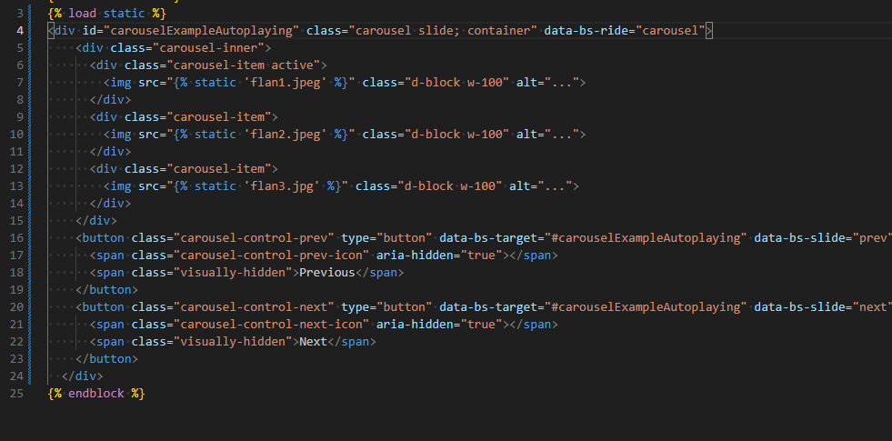
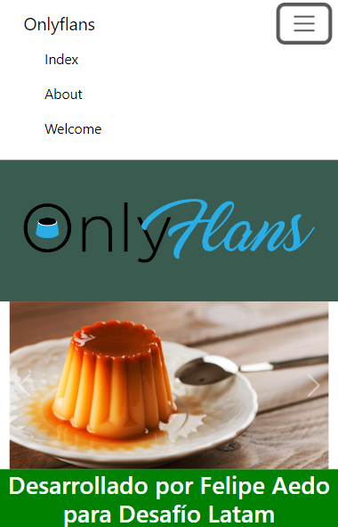
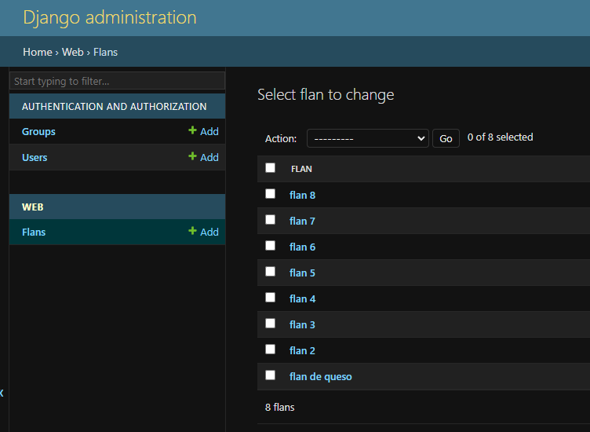

  <h1>Hitos Talento Digital</h1>
  
Documentación de todos los hitos realizados para el bootcamp Desarrollo de aplicaciones Full Stack Python Trainee

<!--  falta por asignar foto onlyflans

  
-->
<!-- tabla de contenidos -->

  
Hitos

  <ol>
    <li><a href="#hito1">Hito 1</a></li>
    <li><a href="#hito2">Hito 2</a></li>
    <li><a href="#hito3">Hito 3</a></li>
    <li><a href="#hito4">Hito 4</a></li>
    <li><a href="#hito5">Hito 5</a></li>
    <li><a href="#hito6">Hito 6</a></li>
    <li><a href="#hito7">Hito 7</a></li>
  </ol>

---

## Hito 1 

- Crear un virtual environment con el nombre a desear, en este caso `onlyflans`.
- Activar dicho entorno.
- Instalar requerimientos necesarios para lograr este proyecto vía `pip install`:

  - Django 4.2
  - asgiref 3.8.1
  - sqlparse 0.4.4
  - dtzdata 2024.1

- Verificar si los requerimientos se encuentran instalados vía `pip freeze`.

 

- Utilizando `django-admin` y `manage.py`  , crear el proyecto `onlyflans`, migrar y ejecutar para comprobar errores.

 

 
(<a href="#readme-top">back to top</a>)

---

## Hito 2 

- Creación de distintos templates HTML

 

- Implementación inicial de bootstrap, en este ejemplo un carrousel para el index

 

- Levantar proyecto para verificar si los cambios se encuentran funcionando, aún falta bastante por implementar, pero va por un buen camino.

 

(<a href="#readme-top">back to top</a>)

---

## Hito 3 

 
 .png)
 .png)
 
 
 
 
  

(<a href="#readme-top">back to top</a>)

---

## Hito 4 

Placeholder

(<a href="#readme-top">back to top</a>)

---

## Hito 5 

Placeholder

(<a href="#readme-top">back to top</a>)

---

## Hito 6 

Placeholder

(<a href="#readme-top">back to top</a>)

---

## Hito 7 

Placeholder

(<a href="#readme-top">back to top</a>)

